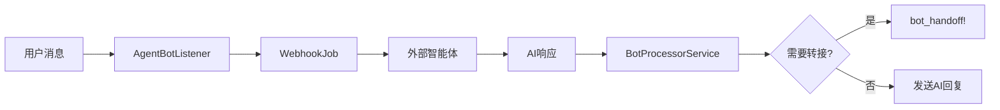

# Chatwoot 外部智能体集成技术文档

## 概述

本文档详细说明如何在 Chatwoot 中集成外部 AI 智能体，实现智能客服自动回复和人工转接功能。基于对 Chatwoot 源码的深入分析，该方案利用现有的 AgentBot 架构，无需修改核心代码即可实现完整的 AI 客服系统。

## 可行性分析

### ✅ 完全可行的原因

1. **内置机器人架构**：Chatwoot 已提供完整的 `AgentBot` 系统
2. **Webhook 支持**：原生支持外部服务集成
3. **人工转接机制**：内置 `bot_handoff!` 方法实现无缝转接
4. **事件驱动**：完善的消息和对话事件监听机制
5. **API 完备**：提供完整的 REST API 支持外部调用

## 核心技术架构

### 1. AgentBot 系统组件

#### 数据模型结构

```ruby
# app/models/agent_bot.rb
class AgentBot < ApplicationRecord
  enum bot_type: { webhook: 0 }
  
  # 关键字段
  # - outgoing_url: 外部智能体 webhook URL
  # - bot_config: JSON 配置存储
  # - access_token: 安全访问令牌
  
  has_many :agent_bot_inboxes, dependent: :destroy_async
  has_many :inboxes, through: :agent_bot_inboxes
end
```

#### 收件箱绑定关系

```ruby
# app/models/agent_bot_inbox.rb
class AgentBotInbox < ApplicationRecord
  belongs_to :inbox
  belongs_to :agent_bot
  belongs_to :account
  
  enum status: { active: 0, inactive: 1 }
end
```

### 2. 事件监听机制

#### AgentBotListener 核心逻辑

```ruby
# app/listeners/agent_bot_listener.rb
class AgentBotListener < BaseListener
  # 监听的关键事件
  def message_created(event)    # 新消息创建
  def message_updated(event)    # 消息更新
  def conversation_opened(event)  # 对话开始
  def conversation_resolved(event) # 对话结束
  def webwidget_triggered(event)  # Widget 触发
end
```

#### Webhook 触发流程



### 3. 消息处理服务

#### BotProcessorService 架构

```ruby
# lib/integrations/bot_processor_service.rb
class Integrations::BotProcessorService
  def perform
    message = event_data[:message]
    return unless should_run_processor?(message)
    
    process_content(message)
  end
  
  private
  
  def process_action(message, action)
    case action
    when 'handoff'
      message.conversation.bot_handoff!  # 转接人工
    when 'resolve'
      message.conversation.resolved!     # 结束对话
    end
  end
end
```

## API 接口说明

### 1. AgentBot 管理 API

#### 创建机器人

```http
POST /api/v1/accounts/{account_id}/agent_bots
Content-Type: application/json
Authorization: Bearer {access_token}

{
  "name": "AI客服助手",
  "description": "智能客服机器人",
  "outgoing_url": "https://your-ai-service.com/webhook",
  "bot_type": "webhook",
  "bot_config": {
    "model": "gpt-4",
    "temperature": 0.7,
    "max_tokens": 1000
  }
}
```

#### 绑定收件箱

```http
POST /api/v1/accounts/{account_id}/inboxes/{inbox_id}/set_agent_bot
Content-Type: application/json
Authorization: Bearer {access_token}

{
  "agent_bot_id": 123
}
```

### 2. 消息发送 API

#### 发送 AI 回复

```http
POST /api/v1/accounts/{account_id}/conversations/{conversation_id}/messages
Content-Type: application/json
Authorization: Bearer {bot_access_token}

{
  "content": "这是 AI 助手的回复内容",
  "message_type": "outgoing",
  "private": false
}
```

#### 触发人工转接

```http
POST /api/v1/accounts/{account_id}/conversations/{conversation_id}/toggle_status
Content-Type: application/json
Authorization: Bearer {bot_access_token}

{
  "status": "open"
}
```

## 外部智能体实现

### 1. Webhook 接收端点

#### 事件数据格式

```json
{
  "event": "message_created",
  "message": {
    "id": 12345,
    "content": "用户问题内容",
    "message_type": "incoming",
    "created_at": "2025-01-11T10:30:00.000Z",
    "conversation": {
      "id": 67890,
      "status": "pending",
      "inbox_id": 100,
      "account_id": 1
    },
    "contact": {
      "id": 500,
      "name": "张三",
      "email": "zhang@example.com",
      "phone": "+86138****1234"
    },
    "inbox": {
      "id": 100,
      "name": "网站客服",
      "channel_type": "Channel::WebWidget"
    },
    "account": {
      "id": 1,
      "name": "公司客服中心"
    }
  }
}
```

### 2. 智能体服务示例

#### Node.js Express 实现

```javascript
const express = require('express');
const axios = require('axios');
const app = express();

app.use(express.json());

// Webhook 接收端点
app.post('/webhook', async (req, res) => {
  try {
    const { event, message } = req.body;
    
    // 只处理用户发送的消息
    if (event !== 'message_created' || message.message_type !== 'incoming') {
      return res.status(200).send('OK');
    }
    
    // 生成 AI 回复
    const aiResponse = await generateAIResponse(message.content);
    
    // 判断是否需要转接人工
    if (aiResponse.needsHandoff) {
      await handoffToAgent(message.conversation.id, aiResponse.reason);
    } else {
      await sendReply(message.conversation.id, aiResponse.content);
    }
    
    res.status(200).send('OK');
  } catch (error) {
    console.error('Webhook处理错误:', error);
    res.status(500).send('Error');
  }
});

// 生成 AI 回复
async function generateAIResponse(userMessage) {
  // 集成您的 AI 模型
  const response = await openai.chat.completions.create({
    model: "gpt-4",
    messages: [
      {
        role: "system",
        content: "你是一个专业的客服助手。如果遇到无法解答的问题，返回 needsHandoff: true"
      },
      {
        role: "user", 
        content: userMessage
      }
    ]
  });
  
  const aiReply = response.choices[0].message.content;
  
  // 简单的转接逻辑示例
  const needsHandoff = aiReply.includes("转人工") || 
                      aiReply.includes("复杂问题") ||
                      userMessage.includes("投诉");
  
  return {
    content: aiReply,
    needsHandoff,
    reason: needsHandoff ? "用户请求或复杂问题" : null
  };
}

// 发送回复到 Chatwoot
async function sendReply(conversationId, content) {
  await axios.post(
    `${CHATWOOT_URL}/api/v1/accounts/${ACCOUNT_ID}/conversations/${conversationId}/messages`,
    {
      content,
      message_type: 'outgoing'
    },
    {
      headers: {
        'Authorization': `Bearer ${BOT_ACCESS_TOKEN}`,
        'Content-Type': 'application/json'
      }
    }
  );
}

// 转接人工坐席
async function handoffToAgent(conversationId, reason) {
  // 先发送转接提示消息
  await sendReply(conversationId, `正在为您转接人工坐席... 原因：${reason}`);
  
  // 触发转接
  await axios.post(
    `${CHATWOOT_URL}/api/v1/accounts/${ACCOUNT_ID}/conversations/${conversationId}/toggle_status`,
    {
      status: 'open'
    },
    {
      headers: {
        'Authorization': `Bearer ${BOT_ACCESS_TOKEN}`,
        'Content-Type': 'application/json'
      }
    }
  );
}

app.listen(3000, () => {
  console.log('AI智能体服务启动在端口 3000');
});
```

### 3. Python Flask 实现

```python
from flask import Flask, request, jsonify
import requests
import openai
import os

app = Flask(__name__)

CHATWOOT_URL = os.getenv('CHATWOOT_URL')
ACCOUNT_ID = os.getenv('ACCOUNT_ID')
BOT_ACCESS_TOKEN = os.getenv('BOT_ACCESS_TOKEN')
openai.api_key = os.getenv('OPENAI_API_KEY')

@app.route('/webhook', methods=['POST'])
def webhook():
    try:
        data = request.json
        event = data.get('event')
        message = data.get('message')
        
        # 只处理用户发送的消息
        if event != 'message_created' or message.get('message_type') != 'incoming':
            return 'OK', 200
            
        # 生成 AI 回复
        ai_response = generate_ai_response(message['content'])
        
        # 处理回复或转接
        if ai_response['needs_handoff']:
            handoff_to_agent(message['conversation']['id'], ai_response['reason'])
        else:
            send_reply(message['conversation']['id'], ai_response['content'])
            
        return 'OK', 200
        
    except Exception as e:
        print(f'Webhook处理错误: {e}')
        return 'Error', 500

def generate_ai_response(user_message):
    """生成 AI 回复"""
    response = openai.ChatCompletion.create(
        model="gpt-4",
        messages=[
            {
                "role": "system",
                "content": "你是专业的客服助手。遇到无法解答的问题时，建议转接人工。"
            },
            {
                "role": "user",
                "content": user_message
            }
        ],
        max_tokens=500,
        temperature=0.7
    )
    
    ai_reply = response.choices[0].message.content
    
    # 转接判断逻辑
    needs_handoff = any(keyword in user_message.lower() for keyword in [
        '投诉', '退款', '人工', '经理', '复杂问题'
    ]) or '无法解答' in ai_reply
    
    return {
        'content': ai_reply,
        'needs_handoff': needs_handoff,
        'reason': '用户请求人工服务' if needs_handoff else None
    }

def send_reply(conversation_id, content):
    """发送回复到 Chatwoot"""
    url = f"{CHATWOOT_URL}/api/v1/accounts/{ACCOUNT_ID}/conversations/{conversation_id}/messages"
    
    requests.post(url, json={
        'content': content,
        'message_type': 'outgoing'
    }, headers={
        'Authorization': f'Bearer {BOT_ACCESS_TOKEN}',
        'Content-Type': 'application/json'
    })

def handoff_to_agent(conversation_id, reason):
    """转接人工坐席"""
    # 发送转接提示
    send_reply(conversation_id, f'正在为您转接人工坐席，请稍候... ({reason})')
    
    # 执行转接
    url = f"{CHATWOOT_URL}/api/v1/accounts/{ACCOUNT_ID}/conversations/{conversation_id}/toggle_status"
    
    requests.post(url, json={
        'status': 'open'
    }, headers={
        'Authorization': f'Bearer {BOT_ACCESS_TOKEN}',
        'Content-Type': 'application/json'
    })

if __name__ == '__main__':
    app.run(host='0.0.0.0', port=5000, debug=True)
```

## 人工转接机制

### 1. 转接触发方式

#### 方式一：API 直接调用

```javascript
// 直接调用状态切换 API
await axios.post(`/api/v1/accounts/${accountId}/conversations/${conversationId}/toggle_status`, {
  status: 'open'
});
```

#### 方式二：BotProcessorService 处理

```javascript
// 返回 handoff 动作，让 Chatwoot 自动处理
return {
  action: 'handoff',
  reason: '用户请求人工服务'
};
```

### 2. 转接流程详解

```ruby
# app/models/conversation.rb:157
def bot_handoff!
  open!  # 状态：pending -> open
  dispatcher_dispatch(CONVERSATION_BOT_HANDOFF)  # 触发事件通知
end
```

#### 状态变化

```
pending (机器人处理中) -> open (等待人工接手)
```

#### 事件通知

```ruby
# lib/events/types.rb:20
CONVERSATION_BOT_HANDOFF = 'conversation.bot_handoff'
```

## 高级功能实现

### 1. 智能路由策略

#### 基于问题类型路由

```javascript
function determineRoutingStrategy(message, userProfile) {
  const content = message.content.toLowerCase();
  
  // VIP 客户优先
  if (userProfile.tier === 'VIP') {
    return {
      action: 'handoff',
      priority: 'urgent',
      reason: 'VIP客户优先服务'
    };
  }
  
  // 技术问题路由到技术支持
  if (content.includes('技术') || content.includes('bug') || content.includes('故障')) {
    return {
      action: 'handoff',
      team: 'technical_support',
      reason: '技术问题需要专业支持'
    };
  }
  
  // 账单问题路由到财务
  if (content.includes('账单') || content.includes('付款') || content.includes('发票')) {
    return {
      action: 'handoff',
      team: 'billing',
      reason: '账单相关问题'
    };
  }
  
  // 其他情况继续 AI 处理
  return { action: 'continue' };
}
```

#### 工作时间检查

```javascript
function checkBusinessHours() {
  const now = new Date();
  const hour = now.getHours();
  const day = now.getDay();
  
  // 工作日 9:00-18:00
  const isBusinessHour = (day >= 1 && day <= 5) && (hour >= 9 && hour < 18);
  
  if (!isBusinessHour) {
    return {
      action: 'auto_reply',
      content: '当前为非工作时间，我是AI助手，将为您提供基础服务。如需人工服务，请在工作时间（周一至周五 9:00-18:00）联系我们。'
    };
  }
  
  return { action: 'continue' };
}
```

### 2. 上下文管理

#### 对话历史存储

```javascript
class ContextManager {
  constructor() {
    this.conversations = new Map();
  }
  
  getContext(conversationId) {
    if (!this.conversations.has(conversationId)) {
      this.conversations.set(conversationId, {
        messages: [],
        userProfile: {},
        intent: null,
        entities: {}
      });
    }
    return this.conversations.get(conversationId);
  }
  
  updateContext(conversationId, message, aiResponse) {
    const context = this.getContext(conversationId);
    
    context.messages.push({
      type: 'user',
      content: message.content,
      timestamp: message.created_at
    });
    
    context.messages.push({
      type: 'ai',
      content: aiResponse.content,
      timestamp: new Date().toISOString()
    });
    
    // 保持最近20条消息
    if (context.messages.length > 20) {
      context.messages = context.messages.slice(-20);
    }
  }
}
```

### 3. 多模态消息支持

#### 图片处理

```javascript
async function handleImageMessage(message) {
  if (message.attachments && message.attachments.length > 0) {
    for (const attachment of message.attachments) {
      if (attachment.file_type === 'image') {
        // 调用图片识别 API
        const imageAnalysis = await analyzeImage(attachment.data_url);
        
        return {
          content: `我看到您发送了一张图片。根据图片内容：${imageAnalysis.description}。${imageAnalysis.response}`,
          needs_handoff: imageAnalysis.complex
        };
      }
    }
  }
  
  return generateTextResponse(message.content);
}
```

#### 文件处理

```javascript
async function handleFileMessage(message) {
  for (const attachment of message.attachments) {
    if (attachment.file_type === 'file') {
      return {
        content: '我看到您发送了文件，人工坐席将更好地为您处理文件相关问题。',
        needs_handoff: true,
        reason: '文件处理需要人工协助'
      };
    }
  }
}
```

## 安全与最佳实践

### 1. 安全配置

#### Webhook 验证

```javascript
const crypto = require('crypto');

function verifyWebhookSignature(payload, signature, secret) {
  const expectedSignature = crypto
    .createHmac('sha256', secret)
    .update(payload)
    .digest('hex');
    
  return crypto.timingSafeEqual(
    Buffer.from(signature),
    Buffer.from(expectedSignature)
  );
}

app.post('/webhook', (req, res) => {
  const signature = req.headers['x-chatwoot-signature'];
  const payload = JSON.stringify(req.body);
  
  if (!verifyWebhookSignature(payload, signature, WEBHOOK_SECRET)) {
    return res.status(401).send('Unauthorized');
  }
  
  // 处理验证通过的请求
  processWebhook(req.body);
  res.status(200).send('OK');
});
```

#### 访问令牌管理

```javascript
class TokenManager {
  constructor() {
    this.tokens = new Map();
  }
  
  async refreshToken(botId) {
    try {
      const response = await axios.post(
        `/api/v1/accounts/${ACCOUNT_ID}/agent_bots/${botId}/reset_access_token`,
        {},
        { headers: { 'Authorization': `Bearer ${ADMIN_TOKEN}` } }
      );
      
      this.tokens.set(botId, response.data.access_token);
      return response.data.access_token;
    } catch (error) {
      console.error('Token刷新失败:', error);
      throw error;
    }
  }
}
```

### 2. 错误处理

#### 重试机制

```javascript
class WebhookProcessor {
  async processMessage(message, retryCount = 0) {
    const MAX_RETRIES = 3;
    
    try {
      const aiResponse = await this.generateResponse(message);
      await this.sendResponse(message.conversation.id, aiResponse);
    } catch (error) {
      if (retryCount < MAX_RETRIES) {
        console.log(`重试 ${retryCount + 1}/${MAX_RETRIES}`);
        await this.delay(1000 * Math.pow(2, retryCount)); // 指数退避
        return this.processMessage(message, retryCount + 1);
      }
      
      // 最终失败，转接人工
      await this.handoffToAgent(
        message.conversation.id, 
        '系统故障，转接人工处理'
      );
    }
  }
  
  delay(ms) {
    return new Promise(resolve => setTimeout(resolve, ms));
  }
}
```

#### 降级策略

```javascript
async function generateResponseWithFallback(userMessage) {
  try {
    // 主 AI 服务
    return await callPrimaryAI(userMessage);
  } catch (error) {
    console.warn('主AI服务失败，使用备用服务');
    
    try {
      // 备用 AI 服务
      return await callSecondaryAI(userMessage);
    } catch (secondError) {
      console.error('备用AI服务也失败，使用预设回复');
      
      // 最终降级到预设回复
      return {
        content: '抱歉，当前服务繁忙，正在为您转接人工坐席...',
        needs_handoff: true,
        reason: '系统故障降级'
      };
    }
  }
}
```

### 3. 性能优化

#### 异步处理

```javascript
const Queue = require('bull');
const messageQueue = new Queue('message processing');

// Webhook 接收端快速响应
app.post('/webhook', (req, res) => {
  // 快速入队，立即返回
  messageQueue.add('process_message', req.body);
  res.status(200).send('OK');
});

// 异步处理队列任务
messageQueue.process('process_message', async (job) => {
  const { event, message } = job.data;
  await processMessageAsync(event, message);
});
```

#### 缓存策略

```javascript
const Redis = require('redis');
const redis = Redis.createClient();

class ResponseCache {
  async getCachedResponse(messageHash) {
    const cached = await redis.get(`response:${messageHash}`);
    return cached ? JSON.parse(cached) : null;
  }
  
  async setCachedResponse(messageHash, response) {
    await redis.setex(
      `response:${messageHash}`, 
      3600, // 1小时过期
      JSON.stringify(response)
    );
  }
  
  generateMessageHash(content) {
    return crypto
      .createHash('md5')
      .update(content.toLowerCase())
      .digest('hex');
  }
}
```

## 监控与分析

### 1. 性能监控

#### 关键指标

```javascript
const metrics = {
  responseTime: [], // 响应时间
  successRate: 0,   // 成功率
  handoffRate: 0,   // 转接率
  messageVolume: 0  // 消息量
};

function recordMetrics(startTime, success, handoff) {
  const responseTime = Date.now() - startTime;
  metrics.responseTime.push(responseTime);
  
  if (success) metrics.successRate++;
  if (handoff) metrics.handoffRate++;
  metrics.messageVolume++;
  
  // 每小时输出统计
  if (metrics.messageVolume % 100 === 0) {
    console.log('性能统计:', {
      avgResponseTime: metrics.responseTime.reduce((a, b) => a + b, 0) / metrics.responseTime.length,
      successRate: (metrics.successRate / metrics.messageVolume * 100).toFixed(2) + '%',
      handoffRate: (metrics.handoffRate / metrics.messageVolume * 100).toFixed(2) + '%',
      totalMessages: metrics.messageVolume
    });
  }
}
```

#### 健康检查

```javascript
app.get('/health', async (req, res) => {
  const health = {
    status: 'healthy',
    timestamp: new Date().toISOString(),
    services: {}
  };
  
  try {
    // 检查 AI 服务
    await checkAIService();
    health.services.ai = 'healthy';
  } catch (error) {
    health.services.ai = 'unhealthy';
    health.status = 'degraded';
  }
  
  try {
    // 检查 Chatwoot 连接
    await checkChatwootConnection();
    health.services.chatwoot = 'healthy';
  } catch (error) {
    health.services.chatwoot = 'unhealthy';
    health.status = 'unhealthy';
  }
  
  res.status(health.status === 'healthy' ? 200 : 503).json(health);
});
```

### 2. 日志记录

#### 结构化日志

```javascript
const winston = require('winston');

const logger = winston.createLogger({
  format: winston.format.combine(
    winston.format.timestamp(),
    winston.format.json()
  ),
  transports: [
    new winston.transports.File({ filename: 'ai-agent.log' }),
    new winston.transports.Console()
  ]
});

function logInteraction(conversationId, userMessage, aiResponse, handoff) {
  logger.info('AI交互记录', {
    conversation_id: conversationId,
    user_message: userMessage,
    ai_response: aiResponse,
    handoff_triggered: handoff,
    timestamp: new Date().toISOString()
  });
}
```

## 部署指南

### 1. Docker 部署

#### Dockerfile

```dockerfile
FROM node:18-alpine

WORKDIR /app

COPY package*.json ./
RUN npm ci --only=production

COPY . .

EXPOSE 3000

USER node

CMD ["node", "server.js"]
```

#### docker-compose.yml

```yaml
version: '3.8'

services:
  ai-agent:
    build: .
    ports:
      - "3000:3000"
    environment:
      - CHATWOOT_URL=https://your-chatwoot.com
      - ACCOUNT_ID=1
      - BOT_ACCESS_TOKEN=your_bot_token
      - OPENAI_API_KEY=your_openai_key
    restart: unless-stopped
    
  redis:
    image: redis:alpine
    restart: unless-stopped
    
  nginx:
    image: nginx:alpine
    ports:
      - "80:80"
      - "443:443"
    volumes:
      - ./nginx.conf:/etc/nginx/nginx.conf
      - ./ssl:/etc/nginx/ssl
    depends_on:
      - ai-agent
    restart: unless-stopped
```

### 2. 生产环境配置

#### 环境变量

```bash
# .env.production
CHATWOOT_URL=https://chat.yourcompany.com
ACCOUNT_ID=1
BOT_ACCESS_TOKEN=your_production_bot_token
WEBHOOK_SECRET=your_webhook_secret

# AI 服务配置
OPENAI_API_KEY=your_openai_key
OPENAI_MODEL=gpt-4
OPENAI_MAX_TOKENS=1000

# Redis 配置
REDIS_URL=redis://localhost:6379

# 监控配置
LOG_LEVEL=info
METRICS_PORT=9090
```

#### Nginx 配置

```nginx
upstream ai_agent {
    server ai-agent:3000;
}

server {
    listen 443 ssl http2;
    server_name ai.yourcompany.com;
    
    ssl_certificate /etc/nginx/ssl/cert.pem;
    ssl_certificate_key /etc/nginx/ssl/key.pem;
    
    location /webhook {
        proxy_pass http://ai_agent;
        proxy_set_header Host $host;
        proxy_set_header X-Real-IP $remote_addr;
        proxy_set_header X-Forwarded-For $proxy_add_x_forwarded_for;
        proxy_set_header X-Forwarded-Proto $scheme;
        
        # Webhook 超时设置
        proxy_connect_timeout 60s;
        proxy_send_timeout 60s;
        proxy_read_timeout 60s;
    }
    
    location /health {
        proxy_pass http://ai_agent;
        access_log off;
    }
}
```

## 故障排除

### 1. 常见问题

#### Webhook 未触发

```bash
# 检查 AgentBot 状态
curl -X GET "https://your-chatwoot.com/api/v1/accounts/1/agent_bots" \
  -H "Authorization: Bearer your_admin_token"

# 检查收件箱绑定
curl -X GET "https://your-chatwoot.com/api/v1/accounts/1/inboxes/1/agent_bot" \
  -H "Authorization: Bearer your_admin_token"
```

#### 消息发送失败

```javascript
// 调试消息发送
async function debugMessageSend(conversationId, content) {
  try {
    const response = await axios.post(
      `${CHATWOOT_URL}/api/v1/accounts/${ACCOUNT_ID}/conversations/${conversationId}/messages`,
      { content, message_type: 'outgoing' },
      { 
        headers: { 'Authorization': `Bearer ${BOT_ACCESS_TOKEN}` },
        timeout: 10000
      }
    );
    
    console.log('消息发送成功:', response.data);
    return response.data;
  } catch (error) {
    console.error('消息发送失败:', {
      status: error.response?.status,
      statusText: error.response?.statusText,
      data: error.response?.data,
      config: {
        url: error.config?.url,
        method: error.config?.method,
        headers: error.config?.headers
      }
    });
    throw error;
  }
}
```

### 2. 性能调优

#### 连接池优化

```javascript
const axios = require('axios');
const https = require('https');

// 创建带连接池的 axios 实例
const chatwootClient = axios.create({
  baseURL: CHATWOOT_URL,
  timeout: 10000,
  httpsAgent: new https.Agent({
    keepAlive: true,
    maxSockets: 100,
    maxFreeSockets: 10,
    timeout: 60000,
    freeSocketTimeout: 30000
  })
});
```

#### 内存使用优化

```javascript
// 定期清理过期的上下文数据
setInterval(() => {
  const now = Date.now();
  const CONTEXT_TTL = 24 * 60 * 60 * 1000; // 24小时
  
  for (const [conversationId, context] of conversations.entries()) {
    if (now - context.lastActivity > CONTEXT_TTL) {
      conversations.delete(conversationId);
    }
  }
}, 60 * 60 * 1000); // 每小时清理一次
```

## 总结

本技术文档详细说明了在 Chatwoot 中集成外部智能体的完整方案。该方案具有以下优势：

1. **零代码修改**：完全基于现有 API 和 Webhook 机制
2. **高可靠性**：内置重试、降级和错误处理机制
3. **易扩展**：支持多种 AI 模型和自定义逻辑
4. **生产就绪**：包含完整的监控、日志和部署方案

通过遵循本文档的指导，您可以快速构建一个功能完整、稳定可靠的 AI 客服系统。

---

*文档版本：v1.0*  
*最后更新：2025-01-11*  
*维护者：智能客服开发团队*