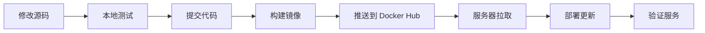

# Chatwoot 自定义镜像构建和部署指南

本指南说明如何基于源码构建 Chatwoot 镜像，并部署到 Stage 环境。

---

## 📋 目录

1. [为什么使用自定义镜像](#为什么使用自定义镜像)
2. [前置准备](#前置准备)
3. [Docker Hub 配置](#docker-hub-配置)
4. [本地构建和推送](#本地构建和推送)
5. [服务器部署](#服务器部署)
6. [版本管理](#版本管理)
7. [从官方镜像切换](#从官方镜像切换)
8. [故障排查](#故障排查)

---

## 为什么使用自定义镜像

使用自定义镜像的优势：

- ✅ **定制化修改** - 可以修改源码添加自定义功能
- ✅ **企业版集成** - 集成 Enterprise 版本功能
- ✅ **版本控制** - 精确控制部署的代码版本
- ✅ **调试方便** - 可以添加调试工具和日志
- ✅ **国内优化** - 可以优化国内访问速度（CDN、字体等）

---

## 前置准备

### 本地开发环境

确保本地已安装：

```bash
# 检查 Docker
docker --version
# 需要 Docker 20.10+ 版本

# 检查 Git
git --version

# 确认在项目根目录
pwd
# 应该显示: /path/to/chatwoot
```

### 服务器环境

Stage 服务器需要：

- Docker 和 Docker Compose 已安装
- 网络可以访问 Docker Hub
- 已有现有的部署配置

---

## Docker Hub 配置

### 1. 创建 Docker Hub 账号

如果还没有 Docker Hub 账号：

1. 访问 https://hub.docker.com/
2. 注册账号（免费）
3. 记录用户名（后续会用到）

### 2. 创建镜像仓库（可选）

在 Docker Hub 创建一个私有或公共仓库：

1. 登录 Docker Hub
2. 点击 "Create Repository"
3. 仓库名称填写：`chatwoot-custom`（或其他名称）
4. 选择 Public（公开）或 Private（私有）
5. 点击 Create

> **注意**：免费账号只有 1 个私有仓库，推荐使用公开仓库或付费升级

### 3. 本地配置构建环境

```bash
# 1. 复制配置模板
cp .env.stage .env.build

# 2. 编辑配置文件
nano .env.build  # 或使用你喜欢的编辑器
```

**配置示例**：

```bash
# 替换为你的 Docker Hub 用户名
DOCKER_USERNAME=zhanfei

# 仓库名称
DOCKER_REPOSITORY=tvcmall-stage-build-chatwoot

# 镜像标签（推荐使用 latest 或版本号）
DOCKER_TAG=latest

# 是否推送 Git commit hash 标签
PUSH_GIT_TAG=true

# 可选：版本号标签
VERSION_TAG=v1.0.0

# 构建参数
RAILS_ENV=production
NODE_ENV=production
RAILS_SERVE_STATIC_FILES=true
BUNDLE_WITHOUT=development:test

# 使用 BuildKit 加速构建
DOCKER_BUILDKIT=1

# 启用缓存
USE_CACHE=true
```

### 4. 登录 Docker Hub

```bash
# 本地登录
docker login

# 输入你的 Docker Hub 用户名和密码

# 成功后会显示: Login Succeeded
```

---

## 本地构建和推送

### 一键构建和推送

使用自动化脚本：

```bash
# 1. 赋予执行权限
chmod +x scripts/build-push-stage.sh

# 2. 执行构建和推送
./scripts/build-push-stage.sh
```

脚本会自动完成：

1. ✅ 检查 Docker 环境
2. ✅ 验证 Docker Hub 登录
3. ✅ 读取构建配置
4. ✅ 构建镜像（多阶段构建）
5. ✅ 推送到 Docker Hub
6. ✅ 生成多个标签（latest, git-hash, version）

**预期输出**：

```
[INFO] 2024-01-20 10:30:00 ==========================================
[INFO] 2024-01-20 10:30:00 Chatwoot 镜像构建配置
[INFO] 2024-01-20 10:30:00 ==========================================
[INFO] 2024-01-20 10:30:00 镜像名称: yourname/chatwoot-custom
[INFO] 2024-01-20 10:30:00 主标签: latest
[INFO] 2024-01-20 10:30:00 工作目录: /path/to/chatwoot
[INFO] 2024-01-20 10:30:00 ==========================================
[STEP] 2024-01-20 10:30:01 检查 Docker Hub 登录状态...
[INFO] 2024-01-20 10:30:01 Git 分支: master
[INFO] 2024-01-20 10:30:01 Git 提交: a1b2c3d
[INFO] 2024-01-20 10:30:01 将构建以下标签:
  - yourname/chatwoot-custom:latest
  - yourname/chatwoot-custom:git-a1b2c3d
  - yourname/chatwoot-custom:v1.0.0
[STEP] 2024-01-20 10:30:02 开始构建镜像...
...
[INFO] 2024-01-20 10:45:00 镜像构建成功！
[STEP] 2024-01-20 10:45:01 推送镜像到 Docker Hub...
[INFO] 2024-01-20 10:45:01 ✓ 推送成功: yourname/chatwoot-custom:latest
[INFO] 2024-01-20 10:45:15 ✓ 推送成功: yourname/chatwoot-custom:git-a1b2c3d
[INFO] 2024-01-20 10:45:30 ✓ 推送成功: yourname/chatwoot-custom:v1.0.0
[INFO] 2024-01-20 10:45:31 ✅ 构建和推送完成！
```

### 手动构建（高级）

如果需要手动控制构建过程：

```bash
# 1. 加载配置
source .env.build

# 2. 构建镜像
docker build \
  --build-arg RAILS_ENV=production \
  --build-arg NODE_ENV=production \
  --build-arg RAILS_SERVE_STATIC_FILES=true \
  --build-arg BUNDLE_WITHOUT=development:test \
  -t ${DOCKER_USERNAME}/${DOCKER_REPOSITORY}:latest \
  -f docker/Dockerfile \
  .

# 3. 推送镜像
docker push ${DOCKER_USERNAME}/${DOCKER_REPOSITORY}:latest

# 4. 查看本地镜像
docker images | grep chatwoot-custom
```

### 构建时间

- **首次构建**：15-30 分钟（需要下载依赖）
- **后续构建**：5-10 分钟（使用缓存）

---

## 服务器部署

### 准备工作

在 Stage 服务器上：

```bash
# 1. SSH 登录服务器
ssh user@115.175.225.110

# 2. 进入项目目录
cd /path/to/chatwoot

# 3. 拉取最新配置
git pull origin master

# 4. 检查配置文件
ls -la docker-compose.stage.build.yaml
```

### 配置镜像信息

创建 `.env.build` 文件（在服务器上）：

```bash
# 创建配置文件
cat > .env.build << EOF
DOCKER_IMAGE=yourname/chatwoot-custom
DOCKER_TAG=latest
EOF

# 验证配置
cat .env.build
```

### 拉取自定义镜像

```bash
# 1. 如果使用私有仓库，先登录 Docker Hub
docker login

# 2. 拉取镜像
docker-compose -f docker-compose.stage.build.yaml pull

# 3. 查看拉取的镜像
docker images | grep chatwoot-custom
```

### 停止旧服务（如果在运行）

```bash
# 如果正在使用官方镜像的配置
docker-compose -f docker-compose.stage.yaml down

# 或者如果已经在使用自定义镜像
docker-compose -f docker-compose.stage.build.yaml down
```

### 启动服务

```bash
# 1. 启动所有服务
docker-compose -f docker-compose.stage.build.yaml up -d

# 2. 查看服务状态
docker-compose -f docker-compose.stage.build.yaml ps

# 3. 查看日志
docker-compose -f docker-compose.stage.build.yaml logs -f rails
```

### 执行数据库迁移（如需要）

```bash
# 如果是首次部署或有数据库变更
docker-compose -f docker-compose.stage.build.yaml exec rails \
  bundle exec rails db:migrate
```

### 验证部署

```bash
# 1. 检查所有容器状态
docker-compose -f docker-compose.stage.build.yaml ps

# 期望看到所有服务都是 "Up" 状态

# 2. 检查网站访问
curl -I https://service.sjlpj.cn

# 3. 查看 Rails 日志
docker-compose -f docker-compose.stage.build.yaml logs --tail=50 rails

# 4. 浏览器测试
# 访问 https://service.sjlpj.cn
```

---

## 版本管理

### 使用语义化版本

推荐使用语义化版本标签：

```bash
# 在 .env.build 中设置版本号
VERSION_TAG=v1.0.0

# 构建和推送
./scripts/build-push-stage.sh

# 会生成三个标签：
# - yourname/chatwoot-custom:latest
# - yourname/chatwoot-custom:git-a1b2c3d
# - yourname/chatwoot-custom:v1.0.0
```

### 部署特定版本

在服务器的 `.env.build` 中指定版本：

```bash
# 使用特定版本
DOCKER_IMAGE=yourname/chatwoot-custom
DOCKER_TAG=v1.0.0

# 或使用 Git commit hash
DOCKER_TAG=git-a1b2c3d
```

### 回滚到之前版本

```bash
# 1. 停止当前服务
docker-compose -f docker-compose.stage.build.yaml down

# 2. 修改 .env.build 指定旧版本
nano .env.build
# 修改 DOCKER_TAG=v0.9.0

# 3. 拉取旧版本镜像
docker-compose -f docker-compose.stage.build.yaml pull

# 4. 启动服务
docker-compose -f docker-compose.stage.build.yaml up -d
```

---

## 从官方镜像切换

### 切换到自定义镜像

如果当前使用官方镜像（`docker-compose.stage.yaml`）：

```bash
# 1. 备份数据库（重要！）
docker-compose -f docker-compose.stage.yaml exec postgres \
  pg_dump -U postgres -d chatwoot | gzip > backup-$(date +%Y%m%d).sql.gz

# 2. 停止官方镜像服务
docker-compose -f docker-compose.stage.yaml down

# 3. 配置自定义镜像
echo "DOCKER_IMAGE=yourname/chatwoot-custom" > .env.build
echo "DOCKER_TAG=latest" >> .env.build

# 4. 拉取自定义镜像
docker-compose -f docker-compose.stage.build.yaml pull

# 5. 启动自定义镜像服务
docker-compose -f docker-compose.stage.build.yaml up -d

# 6. 检查服务状态
docker-compose -f docker-compose.stage.build.yaml ps
```

### 切换回官方镜像

如果需要切换回官方镜像：

```bash
# 1. 停止自定义镜像服务
docker-compose -f docker-compose.stage.build.yaml down

# 2. 启动官方镜像服务
docker-compose -f docker-compose.stage.yaml up -d
```

---

## 故障排查

### 问题 1: 构建失败 - 依赖下载错误

**症状**：
```
ERROR [internal] load metadata for docker.io/library/node:23-alpine
failed to solve: node:23-alpine: failed to resolve source metadata
```

**解决方案**：
```bash
# 检查网络连接
ping docker.io

# 配置 Docker 镜像加速器（国内）
# 编辑 /etc/docker/daemon.json
{
  "registry-mirrors": [
    "https://mirror.ccs.tencentyun.com",
    "https://registry.docker-cn.com"
  ]
}

# 重启 Docker
sudo systemctl restart docker
```

### 问题 2: 推送失败 - 认证错误

**症状**：
```
denied: requested access to the resource is denied
```

**解决方案**：
```bash
# 重新登录 Docker Hub
docker logout
docker login

# 确认用户名和仓库名正确
cat .env.build | grep DOCKER_
```

### 问题 3: 服务器拉取镜像失败

**症状**：
```
Error response from daemon: pull access denied for yourname/chatwoot-custom
```

**解决方案**：
```bash
# 如果是私有仓库，在服务器上登录
docker login

# 检查镜像名称是否正确
docker pull yourname/chatwoot-custom:latest

# 检查仓库权限（Docker Hub 网站）
```

### 问题 4: 容器启动失败

**症状**：
```
rails_1 exited with code 1
```

**解决方案**：
```bash
# 查看详细日志
docker-compose -f docker-compose.stage.build.yaml logs rails

# 常见原因：
# 1. 数据库连接失败 - 检查 .env.stage 中的数据库配置
# 2. SECRET_KEY_BASE 未设置 - 检查 .env.stage
# 3. 端口冲突 - 检查端口占用

# 进入容器调试
docker-compose -f docker-compose.stage.build.yaml run --rm rails bash
```

### 问题 5: 镜像太大

**症状**：
```
镜像大小超过 2GB
```

**解决方案**：
```bash
# 查看镜像层
docker history yourname/chatwoot-custom:latest

# 清理构建缓存
docker builder prune -a

# 优化 Dockerfile（已优化）
# 当前 docker/Dockerfile 已经使用多阶段构建
```

---

## 完整工作流程

### 开发和部署流程



### 标准部署步骤

**本地（开发机）**：

```bash
# 1. 修改代码
git add .
git commit -m "feat: 添加新功能"
git push origin master

# 2. 构建和推送镜像
./scripts/build-push-stage.sh
```

**服务器（Stage 环境）**：

```bash
# 1. 拉取代码和镜像
cd /path/to/chatwoot
git pull origin master
docker-compose -f docker-compose.stage.build.yaml pull

# 2. 重启服务
docker-compose -f docker-compose.stage.build.yaml up -d

# 3. 执行迁移（如需要）
docker-compose -f docker-compose.stage.build.yaml exec rails \
  bundle exec rails db:migrate

# 4. 验证部署
docker-compose -f docker-compose.stage.build.yaml ps
curl -I https://service.sjlpj.cn
```

---

## 高级技巧

### 1. 使用 GitHub Actions 自动构建

创建 `.github/workflows/build-push.yml`：

```yaml
name: Build and Push Docker Image

on:
  push:
    branches: [ master ]
    tags: [ 'v*' ]

jobs:
  build:
    runs-on: ubuntu-latest
    steps:
      - uses: actions/checkout@v2

      - name: Login to Docker Hub
        uses: docker/login-action@v1
        with:
          username: ${{ secrets.DOCKER_USERNAME }}
          password: ${{ secrets.DOCKER_PASSWORD }}

      - name: Build and push
        uses: docker/build-push-action@v2
        with:
          context: .
          file: ./docker/Dockerfile
          push: true
          tags: |
            ${{ secrets.DOCKER_USERNAME }}/chatwoot-custom:latest
            ${{ secrets.DOCKER_USERNAME }}/chatwoot-custom:${{ github.sha }}
```

### 2. 本地缓存加速

```bash
# 使用本地 registry 缓存
docker run -d -p 5000:5000 --name registry registry:2

# 推送到本地 registry
docker tag yourname/chatwoot-custom:latest localhost:5000/chatwoot:latest
docker push localhost:5000/chatwoot:latest
```

### 3. 多平台构建

```bash
# 创建 buildx builder
docker buildx create --name mybuilder --use

# 构建多平台镜像
docker buildx build \
  --platform linux/amd64,linux/arm64 \
  -t yourname/chatwoot-custom:latest \
  -f docker/Dockerfile \
  --push \
  .
```

---

## 相关文档

- [stage-部署指南.md](./stage-部署指南.md) - Stage 环境部署
- [UPGRADE-MANUAL.md](./UPGRADE-MANUAL.md) - 手动升级指南
- [Chatwoot 官方文档](https://www.chatwoot.com/docs/self-hosted)
- [Docker 官方文档](https://docs.docker.com/)

---

## 总结

使用自定义镜像部署 Chatwoot 的关键步骤：

1. ✅ 配置 Docker Hub 账号和仓库
2. ✅ 创建 `.env.build` 配置文件
3. ✅ 本地构建并推送镜像
4. ✅ 服务器拉取并部署镜像
5. ✅ 使用版本标签管理部署

**优势**：
- 完全控制代码版本
- 可以自定义修改
- 便于调试和优化

**注意事项**：
- 定期清理旧镜像
- 使用语义化版本管理
- 做好数据备份

---

祝部署顺利！🚀
